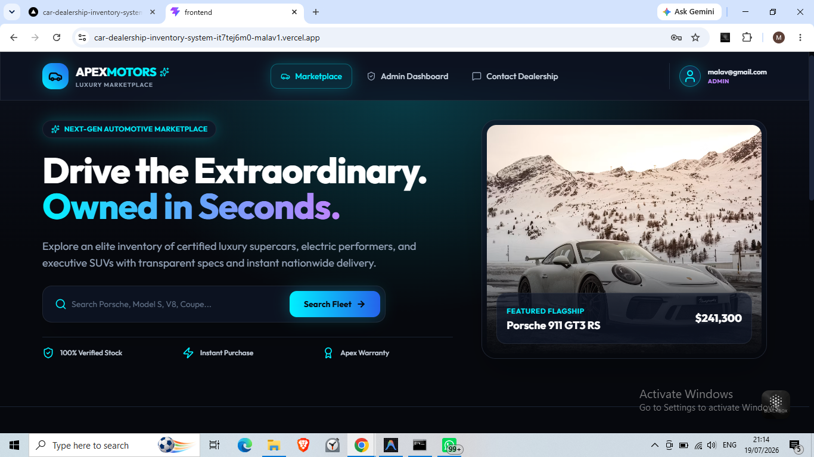
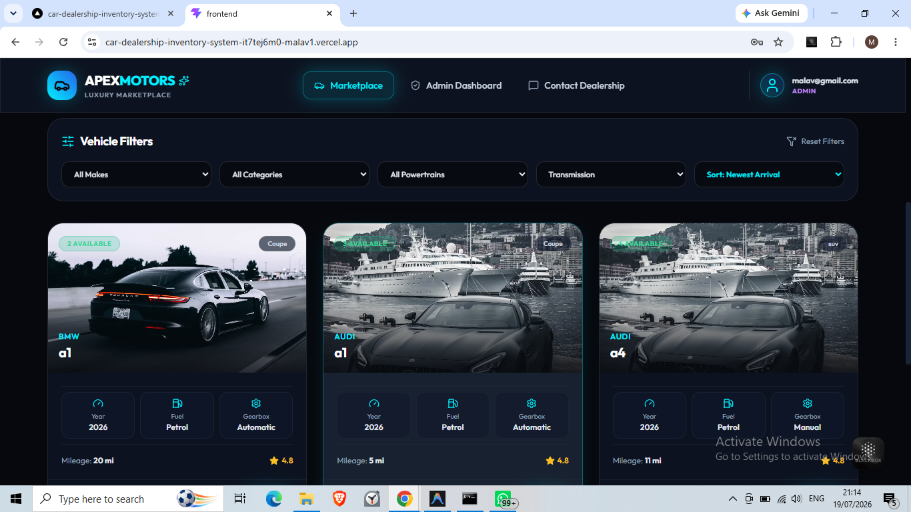
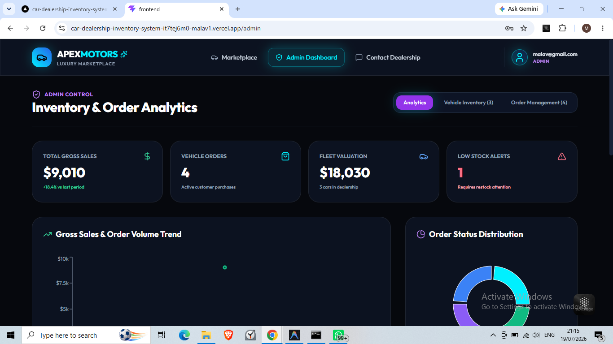

# Apex Motors — Production-Grade Luxury Car Marketplace

A production-quality full-stack Car Marketplace and Dealership Inventory application engineered with Staff-level software design patterns, dark obsidian automotive luxury UI/UX, JWT security, multi-role authorization, Rajkot flagship delivery tracking engine with Leaflet interactive route maps, Haversine geodesic distance calculation, customer inquiry & test drive booking system, 15-brand vehicle image asset catalog, and 39 automated Jest unit tests.

---

## 📸 Application Screenshots

### 🏎️ Customer Experience & Marketplace
| Home Page Showcase | Vehicle Inventory Page |
| :---: | :---: |
|  |  |

| Vehicle Details & Purchase | Live Delivery Tracking Map |
| :---: | :---: |
|  |  |

| Showroom Inquiry & Test Drive |
| :---: |
|  |

### 📊 Executive Admin Dashboard & Analytics
| Admin Executive KPI Overview | Inventory Valuation Analytics |
| :---: | :---: |
|  |  |

| Admin Fleet Control Center | Global Order Management |
| :---: | :---: |
|  |  |

### 🔐 Authentication Flow
| Login Page | Register Page |
| :---: | :---: |
|  |  |

---

## 🌟 Key Application Features

### 🏎️ Luxury Marketplace & Vehicle Discovery
* **Hero Experience**: Animated showcase featuring high-res imagery, search callouts, and performance stats with Framer Motion transitions.
* **Advanced Multi-Parametric Search & Sorting**:
  * Real-time query search across make, model, category, and vehicle descriptions.
  * Filter by `make`, `category` (Coupe, Sedan, SUV, etc.), `fuelType` (Petrol, Electric EV, Hybrid, Diesel), and `transmission`.
  * Price range filtering (`minPrice`, `maxPrice`) and sorting by `price_asc`, `price_desc`, `year_desc`, or `newest`.
* **Vehicle Detail Showcase (`/cars/:id`)**:
  * High-res multi-photo gallery with thumbnail selector and full-screen Lightbox zoom.
  * Technical Specs grid (Engine, Horsepower, 0-60mph acceleration, Top Speed, Drivetrain).
  * Equipment & options checklist with status badges.
  * Interactive Leaflet Dealership location map pin set to Rajkot Flagship Showroom.
  * **Book Test Drive / Showroom Inquiry Modal**.
  * **"Similar Vehicles You Might Like"** AI-inspired recommendations.

### 📍 Rajkot Dealership & Live Delivery Tracking Engine
* **Permanent Dealership Base**: Flagship Showroom situated on 150 Feet Ring Road, Rajkot, Gujarat (`22.3039° N, 70.8022° E`).
* **Geodesic Distance & ETA Telemetry**: Automatically computes Haversine distance in kilometers and calculates estimated delivery days (1–4 days) based on destination coordinates.
* **Delivery Order Progress Stepper**: Modern order lifecycle tracker (`Order Confirmed` → `Preparing Vehicle` → `In Transit` → `Delivered`).
* **Interactive Polyline Delivery Route Map**: Leaflet map plotting polyline route between Rajkot Showroom and customer city with live GPS status badges.

### 📩 Customer Inquiry & Test Drive Booking System
* **Inquiry Modal**: Book test drives, request manager callbacks, or inquire about vehicle pricing directly on vehicle detail pages.
* **Rajkot Concierge Page (`/contact`)**: Dedicated contact page to schedule private showroom visits, submit general questions, and view interactive Rajkot location map.
* **Admin Inquiry Manager**: Executive tab in Admin Dashboard to review, track, and update customer inquiry statuses (`Pending` → `In Progress` → `Resolved`).

### 📸 15-Brand Vehicle Image Asset Library
* **Curated Asset Collection**: High-resolution imagery presets covering 15 top automotive brands (*Toyota, BMW, Audi, Mercedes, Hyundai, Kia, Tata, Mahindra, Honda, Ford, Porsche, Ferrari, Lamborghini, MG, Volvo*).
* **Brand Image Picker Modal**: Interactive modal integrated into Admin Vehicle form allowing 1-click selection of preset brand imagery or custom URL inputs.

### 🎨 Celebration & UX Polish
* **Order Success Page (`/order-success/:orderId`)**: Celebration page with confetti animation, order summary, and instant route tracking link.
* **Breadcrumb Navigation**: Dynamic breadcrumbs across marketplace pages.
* **Profile Dropdown**: User profile avatar pill with email, role badge, quick links to purchases, concierge, and sign-out.
* **Recently Viewed Vehicles**: Local storage persistence tracking customer browsing history.

### 📊 Senior Executive Admin Center (`/admin`)
* **KPI Telemetry**: Real-time Gross Sales ($), Order Count, Fleet Inventory Valuation, and Low Stock Alert counters.
* **Recharts Analytics**: Dynamic bar charts visualizing inventory valuation by category.
* **Low Stock Alerts & Restock Engine**: Instant low stock notification panel with direct restock trigger.
* **Fleet Management**: Searchable inventory table with full CRUD (Add/Edit vehicle modal, image URL manager, brand asset picker, restock, and delete).
* **Order Fulfillment Center**: Global order processing list with status override control (`Order Confirmed`, `Preparing Vehicle`, `In Transit`, `Delivered`, `Cancelled`).
* **Inquiry Management Tab**: Global inquiry list with status updater.

---

## 🛠️ Technology Stack

### Backend
* **Runtime**: Node.js & Express.js
* **Database**: MongoDB (Mongoose ODM with local fallback)
* **Authentication**: JWT (JSON Web Tokens) with bcrypt password hashing
* **Testing Suite**: Jest & Supertest (39 passing unit & integration tests)

### Frontend
* **Build Tool**: Vite (React 19)
* **Styling & UI**: Tailwind CSS v3 with glassmorphism utilities & custom dark obsidian automotive design system
* **Animations**: Framer Motion
* **Maps**: Leaflet & React-Leaflet
* **Charts**: Recharts
* **Notifications**: React Hot Toast

---

## 🌐 Live Demo & Deployment

### 🔗 Live Applications
* **Frontend (Vercel)**: [https://car-dealership-inventory-system-kappa.vercel.app](https://car-dealership-inventory-system-kappa.vercel.app)
* **Backend API (Render)**: [https://car-dealership-inventory-system-hmd3.onrender.com](https://car-dealership-inventory-system-hmd3.onrender.com)

### 🔑 Demo Credentials
* **Admin User**: `admin@apexmotors.com` / `AdminPass123!`
* **Standard User**: `customer@apexmotors.com` / `CustomerPass123!`

### ☁️ Deployment Architecture
* **Frontend Hosting**: Vercel (SPA fallback routing configured via `vercel.json`)
* **Backend Hosting**: Render (Express.js web service)
* **Database Cloud**: MongoDB Atlas
* **Authentication**: Stateless JWT Authentication

---

## 🚀 Getting Started

### Prerequisites
* Node.js (v18+)
* MongoDB connection string (or local MongoDB on `mongodb://127.0.0.1:27017/car-dealership`)

### 1. Setup Backend
```bash
cd backend
npm install
npm run seed     # Seeds vehicles with Rajkot Dealership defaults & admin credentials
npm test         # Executes 39 Jest unit & integration tests
npm start        # Launches server on port 5000 / Render environment port
```

### 2. Setup Frontend
```bash
cd frontend
npm install
npm run dev      # Launches dev server on http://localhost:5173
npm run build    # Builds production bundle
```

---

## 🔌 API Reference Overview

**Base URL**: `https://car-dealership-inventory-system-hmd3.onrender.com/api`

| Category | Endpoint | Method | Access | Description |
| :--- | :--- | :--- | :--- | :--- |
| **Auth** | `/auth/register` | `POST` | Public | Register a new user account |
| **Auth** | `/auth/login` | `POST` | Public | Authenticate user & get JWT token |
| **Auth** | `/auth/me` | `GET` | User / Admin | Fetch current user profile |
| **Vehicles** | `/cars` | `GET` | Public | Fetch all vehicles with search/filter params |
| **Vehicles** | `/cars/:id` | `GET` | Public | Fetch vehicle details by ID |
| **Vehicles** | `/cars` | `POST` | Admin | Add new vehicle to inventory |
| **Vehicles** | `/cars/:id` | `PUT` | Admin | Update vehicle specs & pricing |
| **Vehicles** | `/cars/:id` | `DELETE` | Admin | Delete vehicle from inventory |
| **Vehicles** | `/cars/:id/restock` | `PUT` | Admin | Quick restock vehicle stock |
| **Orders** | `/orders` | `POST` | User / Admin | Place new vehicle purchase order |
| **Orders** | `/orders/my-orders` | `GET` | User / Admin | Get orders placed by current user |
| **Orders** | `/orders` | `GET` | Admin | List all global dealership orders |
| **Orders** | `/orders/:id/status` | `PUT` | Admin | Update delivery order status |
| **Inquiries** | `/inquiries` | `POST` | Public | Submit test drive or general inquiry |
| **Inquiries** | `/inquiries` | `GET` | Admin | Fetch all customer inquiries |
| **Inquiries** | `/inquiries/:id` | `PUT` | Admin | Update inquiry resolution status |

---

## 🔧 Production Improvements & Bug Fixes

* **Vercel SPA Routing**: Implemented `vercel.json` rewrite configuration to prevent 404s on dynamic client-side routes.
* **API Endpoint Standardization**: Unified API base URL handling across local development and production environments.
* **Vehicle Validation Fixes**: Resolved required field validation for `color` during vehicle creation.
* **Endpoint HTTP Method Alignment**: Aligned Restock (`PUT /api/cars/:id/restock`) and Order Status (`PUT /api/orders/:id/status`) HTTP methods.
* **Interactive Map Optimization**: Integrated React-Leaflet map rendering with dynamic Haversine distance tracking for delivery routing.
